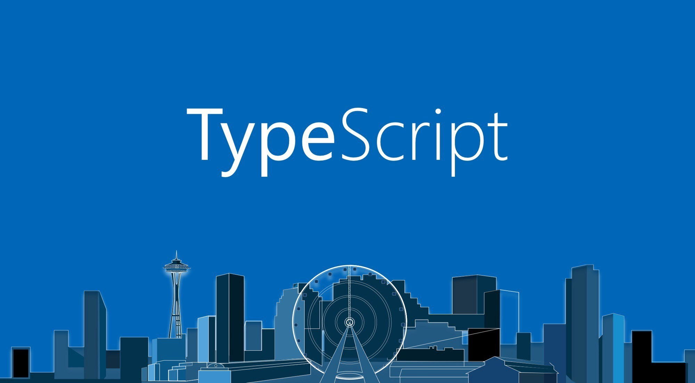

# BookMark

This is an extension for Visual Studio Code that allows you to bookmark file and directory.

## Usage

### `Ctrl+shift+P` search bookmark

### Click right and select add to bookmark tree

## Features

- if window is closed the files and folders will not be deleted
- add folders to bookmarks tree

##

#  

## For more information about me

- [My github](https://github.com/mohammadfarashipoor/)

**Enjoy!**
